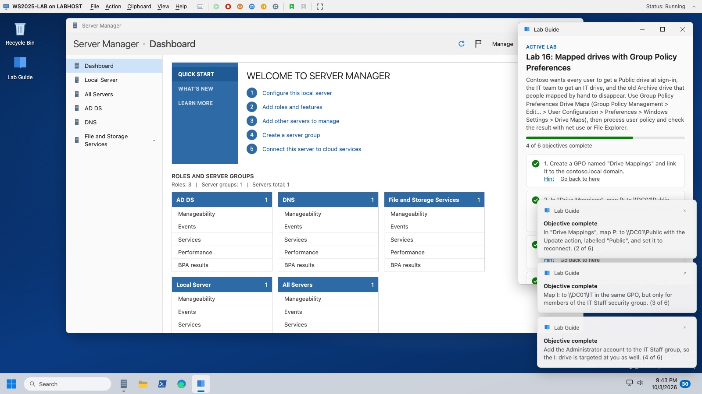

# WinLab

**A Windows Server 2025 lab you can open in a browser tab.** Start in seconds, get live feedback as you work, and explore a full server environment without setting up a VM.



## Why WinLab

Practising Windows Server usually means downloading an ISO, building a VM and rebuilding it every time you break something. Hosted labs fix that, but they're paid, time-limited and slow to start. WinLab takes a different approach:

- **Start in seconds.** Open `index.html` and you're at the sign-in screen. There's nothing to install, no account and no build step.
- **Live feedback.** Lab objectives tick off the moment you complete them, whether you used the GUI or PowerShell. Made a mess? Go back to any earlier step.
- **Room to explore.** It isn't a scripted click-through. Every tool works on the same model of the server: a user created in Active Directory Users and Computers shows up in `Get-ADUser`, and a firewall rule added with `netsh` appears in `wf.msc`. Try things in any order, break them, and fix them.
- **Free and offline.** Plain HTML, CSS and JavaScript. It runs from a file on your computer or from any static web host.

## What's inside

- **Server Manager:** Add Roles and Features, AD DS promotion, DHCP post-install and File and Storage Services.
- **Admin tools:** Active Directory Users and Computers, DNS Manager, DHCP, Group Policy Management (with the editor, `gpupdate`, `gpresult` and Drive Maps preferences), Event Viewer, Services, Computer Management, Disk Management, Windows Defender Firewall with Advanced Security, IIS Manager, Hyper-V Manager (with Virtual Machine Connection and a guest you can install) and Task Manager.
- **Terminal:** PowerShell 5.1 and CMD tabs with an object pipeline, hundreds of cmdlets and native tools, and `sconfig`.
- **Desktop apps:** File Explorer, Notepad, Settings, Control Panel, Network Connections and a mock Edge that browses the lab network.
- **The shell:** Start, Win+X, Run, Quick Settings, notifications, dark mode and window snapping with Snap Assist.
- **A VMConnect-style host bar:** Ctrl+Alt+Delete, power controls, checkpoints, and lab-state export and import.

## Labs

Open **Lab Guide** on the desktop, pick a lab and press **Start lab**. The server resets to the lab's starting point and restarts. Each objective has a hint and checks itself as you work. Labs can also be imported from a JSON file.

| Lab | Level |
|---|---|
| 01: Initial server configuration | Beginner |
| 02: Install AD DS and create a forest | Beginner |
| 03: OUs, users and groups | Beginner |
| 04: DNS records and a reverse zone | Intermediate |
| 05: DHCP scope, options and reservation | Intermediate |
| 06: Disks, volumes and file shares | Intermediate |
| 07: Web Server (IIS) | Intermediate |
| 09: Services and Event Viewer | Beginner |
| 11: Windows Defender Firewall | Intermediate |
| 12: File server with Server Manager | Intermediate |
| 13: Group Policy | Intermediate |
| 14: Processes and Task Manager | Intermediate |
| 15: Hyper-V | Intermediate |
| 16: Mapped drives with Group Policy Preferences | Intermediate |

## Getting started

1. Download or clone this repository.
2. Open `index.html` in Chrome, Edge or Firefox.
3. Go through first-time setup: choose an Administrator password that meets the complexity rules, then sign in.

To skip boot and sign-in, open `index.html?quick=1`. If setup hasn't been done, the password is set to `P@ssw0rd!`.

Your server is saved in the browser's local storage, so it's still there next time. To start over, use **Reset the lab** on the sign-in screen.

## Running the tests

The tests run in headless Firefox and need only Node.js and Firefox, with no packages to install:

```bash
node tests/run-headless.mjs              # every suite
node tests/run-headless.mjs dns labs     # just these suites
node tests/run-headless.mjs snap --shot assist   # stop at a screen and save a screenshot
```

Logs, DOM dumps and screenshots go to `.test-output/`.

## Roadmap

- **Sandbox mode:** jump straight into a ready-made server (fresh install, configured server or domain controller) with no objectives.
- **Troubleshooting labs:** start from a broken server and find and fix the cause.
- **More labs:** a PowerShell-only challenge and a Server Core lab with `sconfig`.
- **More depth:** NTFS permissions, Storage Spaces, a registry and `regedit`, and more Group Policy Preferences.

## Disclaimer

WinLab is an independent, unofficial training simulator. It isn't affiliated with, endorsed by or sponsored by Microsoft. Windows, Windows Server, Active Directory, Hyper-V and related names are trademarks of Microsoft Corporation and are used only to describe what the simulator imitates. WinLab contains no Microsoft code or images: its icons and backgrounds are original.

WinLab simulates Windows Server for study. Behaviour may differ from the real product, so check anything important against Windows Server itself and Microsoft's documentation.
